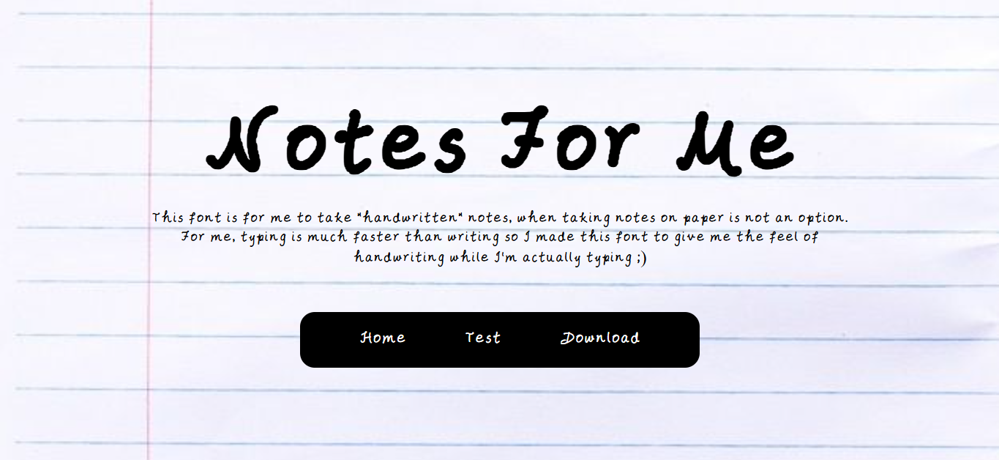
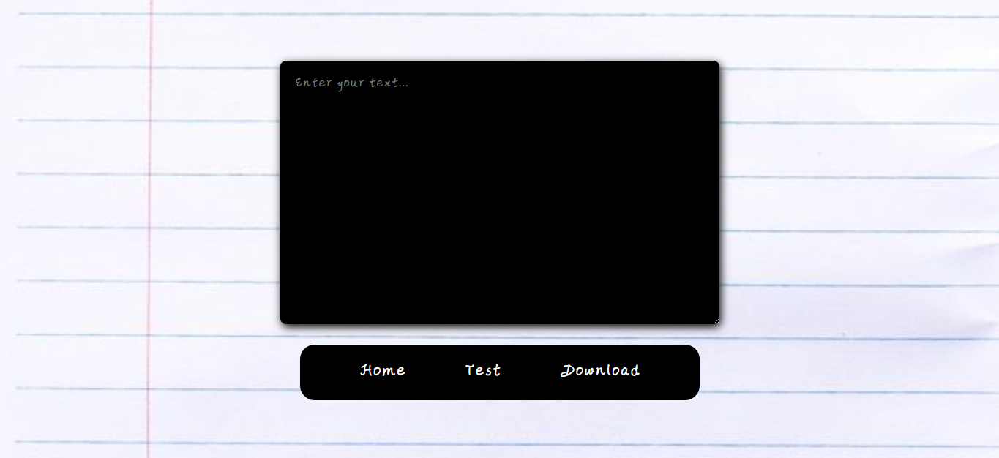
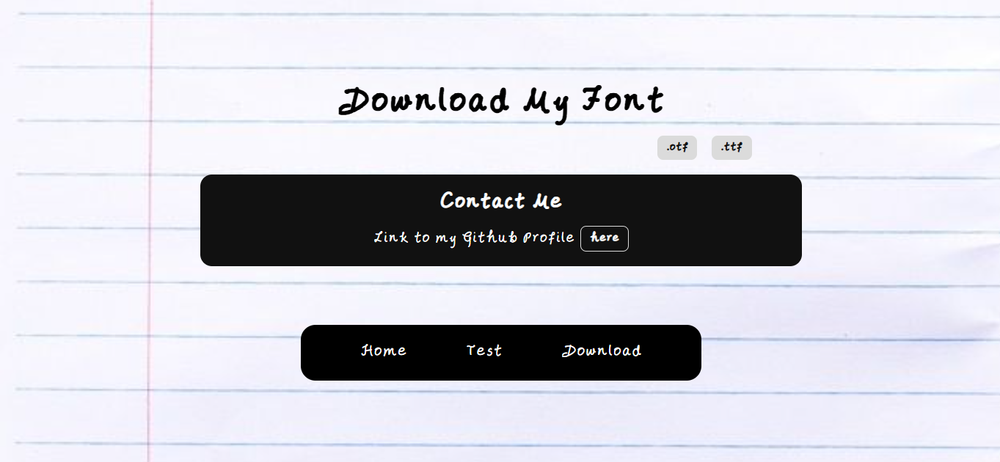

# class notes
this is a website to display the font I made with my handwriting. Usually, I type faster than I can write. So I made a font with my handwriting, for situations when I need my writing but do not have the time to write it myself. It helps for some homework I forgot about till really late at night.

<!-- #rough idea for now
    since it is my handwriting font, I want to make it like a notes thing, so the website is basically a big notebook page with lines, and I use the writing font for that. The other elements would also be a school supplies theme(so a pencil for the page on trying the font, eraser for the clear button, etc.)
    pages to incl: home pg, try it pg, and downloads pg -- with a nav bar  -->

Home page

Test page

Download page

## features
- my custom made handwrtten font
- home page with heading in center
- test page with a textarea to see your text in my handwritten font
- downloaad page to download the font in case you want to use it in your website
- navbar with simple hover animation